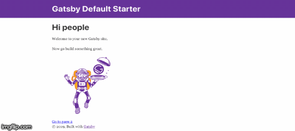

# **Hello World Example**

## **Usage of gatsby-theme-uxworks**

### **Step 1**

Install typography, react-typography, gatsby-plugin-typography and typography-theme-uxworks

__npm__

```
npm install --save typography react-typography gatsby-plugin-typography typography-theme-uxworks
```

__yarn__

```
yarn add typography react-typography gatsby-plugin-typography typography-theme-uxworks
```

### **Step 2**

Create `typography.js` file in the location of `src/utils`

### **Step 3**

Copy these code into `typography.js`

```
import Typography from "typography"
import uxworksTheme from 'typography-theme-uxworks'
const typography = new Typography(uxworksTheme)
export default typography
```

### **Step 4**

config newly created `typography.js` into `gatsby-config.js`

```
{
  resolve: `gatsby-plugin-typography`,
  options: {
    pathToConfigModule: `src/utils/typography`,
  }
},
```

Notes*: Make sure you don't have any overriding css in your App

### Result
After using typography-theme-uxworks


